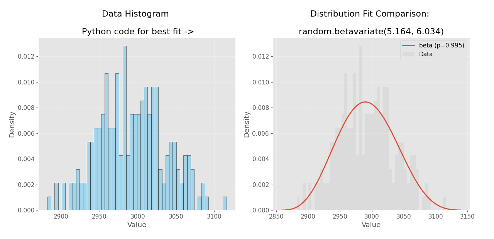
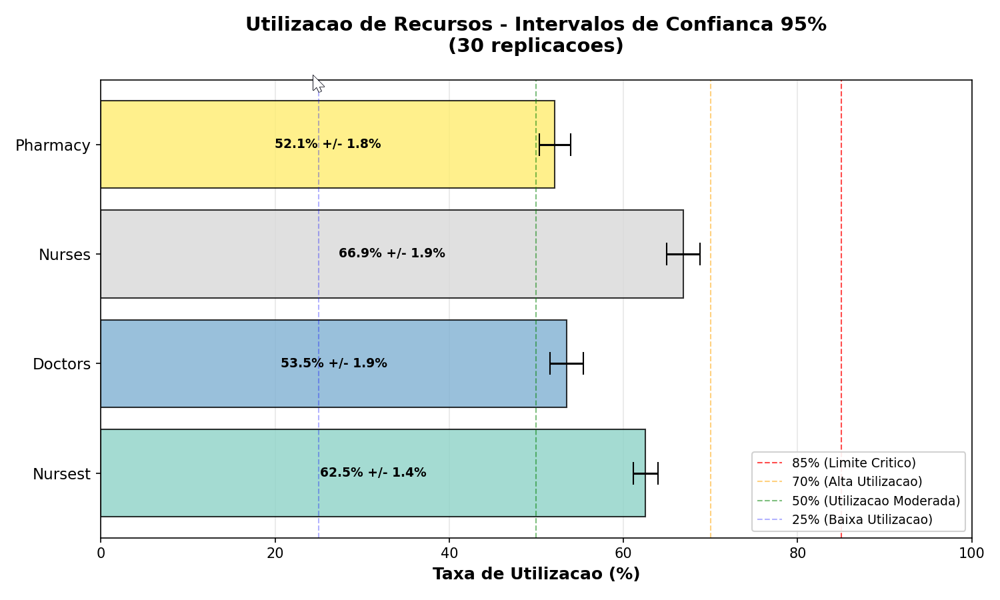
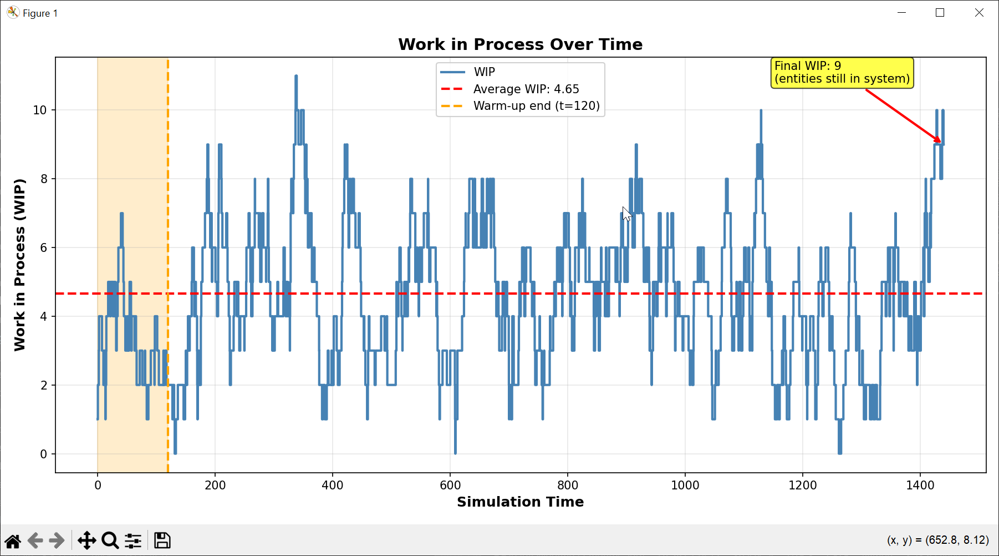
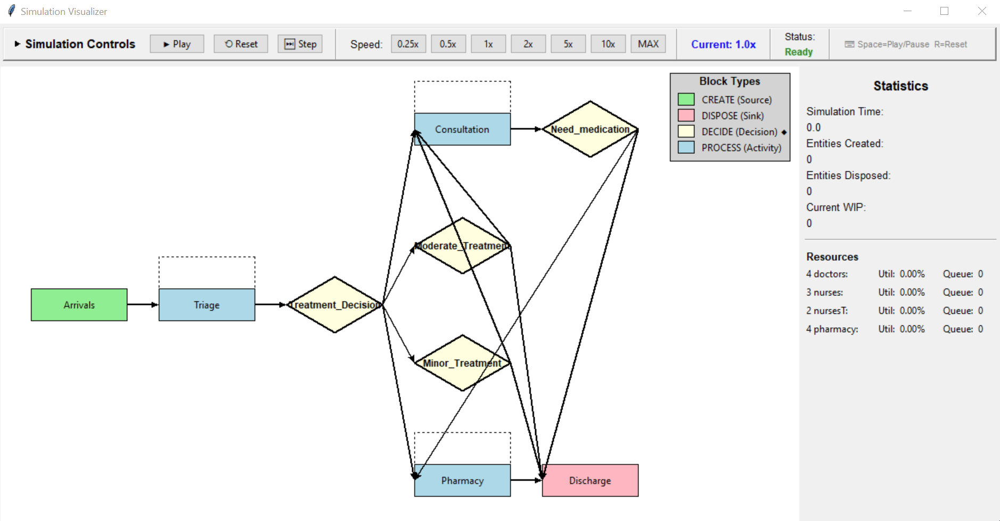
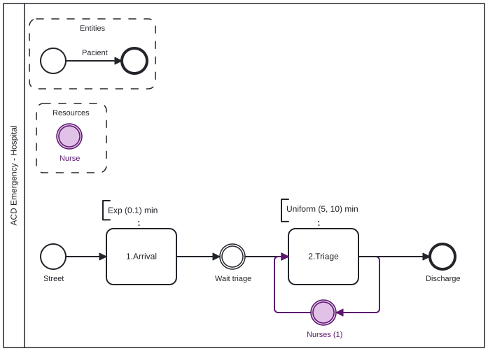
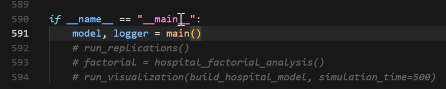
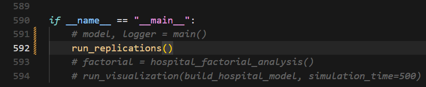
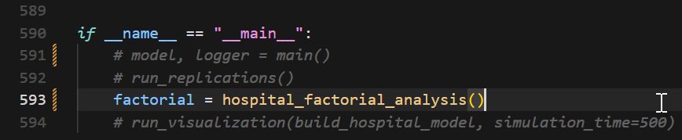
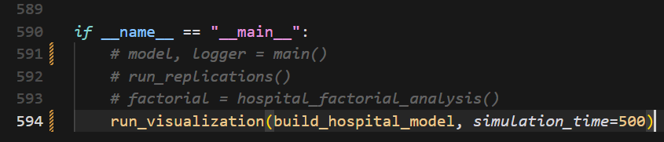

# DESK — Discrete Event Simulation Kit

[](https://doi.org/10.5281/zenodo.18088013)
[](LICENSE)

[](https://desk-sim.readthedocs.io/en/latest/?badge=latest)


A comprehensive Python framework for **Discrete Event Simulation** with advanced analysis, visualization, and experimental design capabilities.

---

## 📋 Overview

**DESK (Discrete Event Simulation Kit)** is a professional-grade simulation framework built on top of **SimPy**, designed for modeling complex systems such as hospitals, call centers, manufacturing, and service operations.

DESK addresses the gap of structured experimental design and replication automation in discrete-event simulation workflows.

The framework emphasizes:
- modularity,
- reusability,
- transparency (visualization and event logs),
- and rigorous statistical analysis.

DESK is suitable for **teaching, research, and applied decision support**.

---

## ✨ Key Features

### Core Simulation Engine
- **Modular Block Architecture**: Reusable building blocks (`CREATE`, `PROCESS`, `DECIDE`, `DISPOSE`)
- **Advanced Resource Management**: Regular, priority-based, and preemptive resources
- **Entity Attributes & State Variables**: Dynamic assignment and modification
- **Priority Scheduling**: Activity-level and entity-level priority control
- **Event Tracing**: Comprehensive event logging with filtering and replay
- **Visualization**: Graphical interface sincronized with event log printing


---

### Input Analysis (`desk-distfit`)
- **DistFit Tool**: Automated distribution fitting with statistical tests (`desk-distfit`) 
- Supports 9+ distributions:
  - uniform, triangular, exponential, normal, lognormal, beta, gamma, Weibull
- Kolmogorov–Smirnov goodness-of-fit tests
- Automatic Python `random` code generation
- Multiple output formats: table, JSON, CSV



---

### Experimental Design & Analysis
- **Replication Framework**: Automated multi-run experiments with confidence intervals
- **Factorial Experiments**: Full factorial design with interaction analysis
- **Warm-Up Analysis**: Automated transient detection
- **Stability Analysis**: Capacity analysis on utilization (ρ < 1)


---

### Performance Metrics
- **Entity Metrics**: System time, queue time, service time
- **Resource Metrics**: Utilization, queue length, busy/idle time
- **WIP Tracking**: Time-weighted work-in-process analysis
- **Financial Analysis**: Cost and revenue per activity
- **Little’s Law Verification**: Automatic analysis on stability: The average number of items in the system (L) equals the average arrival rate (λ) multiplied by the average time an item spends in the system (W): L = λW


---

### Visualization & Reporting
- **Real-Time Visualization**: Process animation during simulation
- **Statistical Plots**:
  - Resource utilization over time
  - WIP evolution
  - System time distributions
  - Activity-level metrics
- **BupaR Integration**: Process mining and animation in R ([processanimateR](https://bupaverse.github.io/processanimateR/)).

- **Automated Reports**: Results with diagnostics and recommendations



---

## 🚀 Quick Start

### Installation

```bash
# Clone the repository
git clone https://github.com/joaoflavioufmg/desk.git
cd desk

# Install dependencies
pip install .
# or
pip install -e .

# Then test:
desk-distfit -h
desk-distfit -d distfit/data.txt
```


# DESK — Discrete Event Simulation Kit

## 🚀 Basic Example

---
*DESK adopts BPMN (.bpmn) as an open, tool-independent notation for representing activity-cycle and process-interaction models. Although BPMN is not a simulation-native language, its standardized semantics and widespread support make it a suitable representation for discrete-event simulation models.*

Models in `.bpmn` format can be created and shared using the
[BPMN Web Modeler (bpmn.io)](https://demo.bpmn.io/).


---


---

```python
def build_model(until=None, event_logger=None, verbose=True): 
    
    import random
    from core.simulation_model import SimulationModel
    from core.entity import EventLogger
    from blocks.create_block import CreateBlock
    from blocks.process_block import ProcessBlock
    from blocks.dispose_block import DisposeBlock
    
    HOURS = 60  # Time conversion factor (base time: minutes)
    DAYS = 1440
    YEARS = 525600
    
    # Create model
    model = SimulationModel()
    event_logger = EventLogger()

    # Add resources
    nurses = model.add_resource("Nurses", capacity=3, resource_type="priority")

    # Define blocks
    arrivals = CreateBlock(
        "Arrivals", model.env,
        inter_arrival_time=lambda: random.expovariate(1/10),
        entity_prefix="Patient",
        event_logger=event_logger
    )

    triage = ProcessBlock(
        "Triage", model.env,
        resource=nurses,
        delay_time=lambda: random.uniform(5, 10),
        resource_units=1,
        event_logger=event_logger
    )

    discharge = DisposeBlock("Discharge", model.env, event_logger=event_logger)

    # Register blocks
    for block in [arrivals, triage, discharge]:
        model.add_block(block)

    # Connect flow
    arrivals.connect_to(triage)
    triage.connect_to(discharge)
    
    return model
    
    
# Run a simulation replication
model = build_model()
model.run_simulation(
    until=480,          # 8 hours
    warm_up_period=60,  # 1 hour
    seed=123
)

# Report results
from analytics.reporting import SimulationReporter
reporter = SimulationReporter(model)
reporter.print_results()
reporter._print_activity_metrics()
reporter._print_resource_metrics()
reporter._print_entity_counts()
reporter._print_block_statistics()
```

---

## 📊 Input Analysis with Desk-DistFit

*How were the input models used in the previous example—such as `random.expovariate(1/10)` or `random.uniform(5, 10)`—derived from empirical data?*

Within DESK, `desk-distfit` addresses this question by performing statistical input analysis, identifying the probability distribution that best fits observed data and replacing heuristic assumptions with data-driven, statistically validated simulation inputs.

`desk-distfit` is the official DESK input-analysis CLI for statistically fitting probability distributions to empirical data. 

*DESK adopts a verb-oriented command-line interface, where simulation tasks are expressed as structured actions (`desk-distfit`), ensuring consistency, reproducibility, and ease of learning across the framework.*

Fit probability distributions to empirical data:

```bash
# Basic usage
desk-distfit -d distfit/data.txt

# Custom significance level
desk-distfit -d distfit/data.txt -a 0.01

# Test specific distributions
desk-distfit -d distfit/data.txt --distributions norm expon gamma

# Save results
desk-distfit -d distfit/data.txt -o results.txt --format json

# Skip plotting
desk-distfit -d distfit/data.txt --no-plot

# Or run as a python module, from desk/ 
py -m distfit.distfit -d distfit/data1.txt
```

**Output includes:**

* Goodness-of-fit statistics
* Best-fit distribution
* Parameter estimates
* Ready-to-use Python code


See [DESK Distribution Fitting Tool](#desk-distribution-fitting-tool-desk-distfit) for further details.


---

## 🧪 Experimental Design

### Replication Analysis

```python
# Define simulation function wrapper
def simulation_wrapper(seed=None, until=None, warm_up_period=None):
    """Wrapper function for replication framework."""
    
    from core.entity import EventLogger
    event_logger = EventLogger()

    # Create a fresh model
    model = build_model(until=until, event_logger=event_logger, verbose=False)
    
    model.run_simulation(
        validate_resources=False,
        until=until,
        seed=seed,
        warm_up_period=warm_up_period
    )
    
    return model

def run_replications():
    from stats.replication import ReplicationFramework
    
    replication_framework = ReplicationFramework(
        simulation_function=simulation_wrapper,
        n_replications=30
    )

    HOURS = 60  # Time conversion factor (base time: minutes)
    DAYS = 1440
    YEARS = 525600
    
    replication_framework.run_replications(
        base_seed=12345,
        until=8*HOURS,
        warm_up_period=1*HOURS
    )

    # Access results
    df = replication_framework.get_results_dataframe()
    print(df.describe())

   
# Run a full simulation    
run_replications()
```

### Factorial Experiments

```python
def factorial_analysis():
    """Factorial analysis with simulation."""
    
    from stats.factorial import FactorialExperiment

    HOURS = 60  # Time conversion factor (base time: minutes)
    DAYS = 1440
    YEARS = 525600
    

    def simulation_wrapper(arrival_rate=1, num_nurses=1,
                                seed=None, until=None, warm_up_period=0, **kwargs):
        """Wrapper that adapts parameters for factorial analysis."""

        from core.entity import EventLogger
        event_logger = EventLogger()

        # Create a fresh model
        model = build_model(until=until, event_logger=event_logger, verbose=False)
        
        model.run_simulation(
            validate_resources=False,
            until=until,
            seed=seed,
            warm_up_period=warm_up_period
        )
        
        return model
    
    # Create factorial analysis
    factorial = FactorialExperiment(
        simulation_function=simulation_wrapper,
        base_seed=12345
    )
    
    # Add factors
    factorial.add_factor(
        factor_name='arrival_rate',
        parameter_path='CreateBlock.inter_arrival_time',
        levels=[1, 2, 3],  # Minutes between arrivals
        description='Inter arrival rates (min)'
    )
    
    factorial.add_factor(
        factor_name='num_nurses',
        parameter_path='Resource.nurses.capacity',
        levels=[1, 2, 3],
        description='Number of nurses'
    )
    
    
    # Run experiment
    factorial.run_factorial_experiment(
        n_replications=5,
        simulation_time=4*HOURS,  # 4 hours
        warm_up_period=1/2*HOURS,    # 1/2 hour
        verbose=True
    )
    
    # Analyze results
    factorial.print_summary()
    factorial.plot_correlation_matrix()
    factorial.plot_main_effects('system_time_avg')
    factorial.plot_interaction_effects('system_time_avg', 'arrival_rate', 'num_nurses')
     
    return factorial

# Run factorial analysis
factorial_analysis()
```

---

## 📂 Project Structure

```text
DESK/
├── config/                    # Simulation setting
├── core/                      # Core simulation engine
├── blocks/                    # Simulation building blocks
├── analytics/                 # Metrics, plots, reports
├── stats/                     # Replication & factorial design
├── validation/                # Stability and warm-up analysis
├── visualization/             # Real-time visualization
├── distfit/distfit.py         # DistFit CLI tool
├── examples/
├── 1) hospital.py             # Hospital example
├── 2) 2.py                    # Restaurant example
├── 3) 3.py, 3a.py, 3b.py      # Call center (and variations 3a, 3b)
└── README.md
```

---

## 🎓 Example Models

1) **Hospital Emergency Department**
  Triage, multiple resources, priority routing, financial tracking

2) **Restaurant Service**
  Multi-resource activities, dynamic attributes, financials

3) **Call Center with Lost Calls**
  Trunk capacity, blocking, retrials, custom KPIs


---
## 🎓 Running examples

For each example, activate the line for each activity: (1) replication, (2) full simulation, (3) factorial analysis and (4) visualization

1) One replication 

 

2) Full simulation (run replications)



3) Factorial analysis



4) Visualization


---


---

## 🔬 Validation & Verification

DESK includes:

* Stability checker (utilization ρ < 1)
* Resource consistency validation
* Little’s Law analysis
* Automated warm-up suggestion

---

## 🛠️ Requirements

* Python >= 3.10
* simpy == 4.1.1
* numpy == 2.2.6
* pandas == 2.3.1
* scipy == 1.15.3
* matplotlib == 3.10.5

**Optional (for process mining):**

* R >= 4.0
* BupaR
* processanimateR

---
## DESK Distribution Fitting Tool (Desk-DistFit)
 
Desk DistFit (`desk-distfit`) is a Python tool for fitting probability distributions to empirical data using statistical tests. This tool helps identify the best-fitting probability distribution from a set of common distributions and provides Python code for generating random numbers from the fitted distribution. It can be used with the Discrete Event Simulation Kit (DESK).

## Features

- **Multiple Distribution Support**: Tests 9 common probability distributions (uniform, triangular, exponential, normal, lognormal, beta, gamma, Weibull)
- **Statistical Testing**: Uses Kolmogorov-Smirnov test for goodness-of-fit assessment
- **Command-Line Interface**: Easy-to-use CLI with comprehensive options
- **Multiple Output Formats**: Results can be saved as table, CSV, or JSON
- **Visualization**: Generates comparative plots of fitted distributions
- **Python Code Generation**: Automatically generates Python `random` module code for the best-fitting distribution
- **Robust Error Handling**: Comprehensive error handling and logging

## Installation

### Prerequisites

- Python 3.10 or higher

### Quick Install

```bash
# Clone the repository
git clone https://github.com/joaoflavioufmg/desk.git
cd desk
```


2. Install dependencies:
```bash
pip install .
# or
pip install -e .
```

3. Run the tool for info (help):
```bash
desk-distfit -h
```

## Usage

### Basic Usage

```bash
desk-distfit -d your_data_file.txt
```

### Command-Line Options

| Option | Description | Default |
|--------|-------------|---------|
| `-d, --data` | Path to data file (required) | - |
| `-a, --alpha` | Significance level for statistical tests | 0.05 |
| `-b, --bins` | Number of histogram bins | 50 |
| `--distributions` | Specific distributions to test | All |
| `--no-plot` | Skip generating plots | False |
| `--show-all` | Show all distributions in plot | False |
| `-o, --output` | Output file path | None |
| `--format` | Output format (table/csv/json) | table |
| `-v, --verbose` | Enable verbose logging | False |
| `-h, --help` | Show help message | - |

### Examples

```bash
# Basic analysis
desk-distfit -d data.txt

# Custom significance level
desk-distfit -d data.txt -a 0.01

# Test specific distributions only
desk-distfit -d data.txt --distributions norm expon gamma

# Save results to file
desk-distfit -d data.txt -o results.txt

# Generate CSV output
desk-distfit -d data.txt -o results.csv --format csv

# Skip plotting (useful for batch processing)
desk-distfit -d data.txt --no-plot

# Show all fitted distributions in plot
desk-distfit -d data.txt --show-all

# Verbose output for debugging
desk-distfit -d data.txt -v

# Complete example with multiple options
desk-distfit -d data.txt -a 0.01 -b 100 --show-all -o results.json --format json -v
```

## Input Data Format

The input file should contain one numeric value per line:

```
1.234
2.567
0.891
3.456
...
```

**Supported formats:**
- Plain text files (.txt)
- One number per line
- UTF-8 encoding
- Blank lines are ignored

## Supported Distributions

| Distribution | Python Random Function | Parameters |
|-------------|------------------------|------------|
| Uniform | `random.uniform(a, b)` | a, b |
| Triangular | `random.triangular(low, high, mode)` | low, high, mode |
| Exponential | `random.expovariate(lambd)` | lambda |
| Normal | `random.gauss(mu, sigma)` | mu, sigma |
| Log-Normal | `random.lognormvariate(mu, sigma)` | mu, sigma |
| Beta | `random.betavariate(alpha, beta)` | alpha, beta |
| Gamma | `random.gammavariate(alpha, beta)` | alpha, beta |
| Weibull (Min) | `random.weibullvariate(alpha, beta)` | alpha, beta |
| Weibull (Max) | `random.weibullvariate(alpha, beta)` | alpha, beta |

## Output

### Console Output

The tool provides:
1. **Data statistics** (sample size, mean, std dev, min, max)
2. **Distribution fitting results** with p-values and significance indicators
3. **Parameter details** for all fitted distributions
4. **Summary report** with best-fitting distribution
5. **Python code** for generating random numbers

### Example Output

```
Data Statistics:
Sample size: 200
Mean: 2.0156
Std Dev: 2.0298
Min: 0.0089
Max: 11.2445

Item Distribution   Statistic   P-value     Significant
------------------------------------------------------------
1    expon          0.0456      0.8234      (*)
2    gamma          0.0523      0.7891      (*)
3    norm           0.0789      0.4567      
...

Distribution Fitting Summary Report
==================================================

Best Fitting Distribution: expon
- Parameters: loc=0.000, scale=2.016
- P-value: 0.8234
- Significant at α=0.05: Yes

Python Random Code:
random.expovariate(0.496)
```

### File Output Formats

#### Table Format (default)
Human-readable text format with detailed results and parameters.

#### CSV Format
```csv
Distribution,P_value,Statistic,Significant,Python_Code
expon,0.823400,0.045600,Yes,random.expovariate(0.496)
gamma,0.789100,0.052300,Yes,random.gammavariate(1.024,0.496)
...
```

#### JSON Format
```json
{
  "summary": {
    "sample_size": 200,
    "best_distribution": "expon",
    "alpha": 0.05
  },
  "results": [
    {
      "distribution": "expon",
      "p_value": 0.8234,
      "statistic": 0.0456,
      "parameters": {"loc": 0.0, "scale": 2.016},
      "significant": true,
      "python_code": "random.expovariate(0.496)"
    }
  ]
}
```

## Interpretation

### P-Values
- **p ≥ α**: Distribution is a good fit (significant)
- **p < α**: Distribution is not a good fit (reject)
- Higher p-values indicate better fits

### Significance Indicators
- **(*) asterisk**: Indicates significant fit at the chosen α level
- Results are sorted by p-value (best fit first)

## Programmatic Usage

You can also use the tool as a Python module:

```python
from distfit import DistributionFitter

# Create fitter instance
fitter = DistributionFitter(alpha=0.05, bins=50)

# Load data
fitter.load_data("your_data.txt")

# Or set data directly
import numpy as np
data = np.random.exponential(2.0, 1000)
fitter.set_data(data)

# Fit distributions
results = fitter.fit_distributions()

# Get best fit
best_fit = fitter.get_best_fit()
print(f"Best distribution: {best_fit.name}")
print(f"P-value: {best_fit.p_value:.4f}")

# Generate Python code
code = fitter.get_python_random_code(best_fit)
print(f"Python code: {code}")

# Create plots
fitter.plot_results(show_all=True)

# Generate report
report = fitter.generate_summary_report()
print(report)
```

## Statistical Method

The tool uses the **Kolmogorov-Smirnov test** to assess goodness-of-fit:

1. **Null Hypothesis (H₀)**: The data follows the tested distribution
2. **Alternative Hypothesis (H₁)**: The data does not follow the tested distribution
3. **Test Statistic**: Maximum difference between empirical and theoretical CDFs
4. **Decision Rule**: Reject H₀ if p-value < α

## Limitations

- **Sample Size**: Requires sufficient data points (recommended: n ≥ 30)
- **Distribution Assumptions**: Only tests common continuous distributions
- **Parameter Estimation**: Uses Maximum Likelihood Estimation (MLE)
- **Independence**: Assumes data points are independent
- **Stationarity**: Assumes data comes from a stationary process

### Common Issues

1. **"File not found" error**
   ```bash
   # Check file path and existence
   ls -la your_data.txt
   ```

2. **"No module named" errors**
   ```bash
   # Install missing packages
   pip install numpy pandas scipy matplotlib
   ```

3. **Empty or invalid data**
   - Ensure file contains numeric values
   - Check for proper encoding (UTF-8)
   - Remove headers or non-numeric content

4. **Plotting errors**
   ```bash
   # Use --no-plot flag to skip visualization
   python input.py -d data.txt --no-plot
   ```

### Getting Help

```bash
# Show detailed help
desk-distfit -h

# Enable verbose output for debugging
desk-distfit -d data.txt -v
```

### Development Setup

```bash
# Clone the repository
git clone https://github.com/joaoflavioufmg/desk.git
cd desk/

# Create virtual environment
python -m venv venv
source venv/bin/activate  # On Windows: venv\Scripts\activate

# Install development dependencies
pip install .

# Run tests
pytest 
```

## References

1. Massey Jr, F. J. (1951). The Kolmogorov-Smirnov test for goodness of fit. Journal of the American statistical Association, 46(253), 68-78.
2. Scipy.stats documentation: https://docs.scipy.org/doc/scipy/reference/stats.html
3. Distribution fitting with Python: https://medium.com/@amirarsalan.rajabi/distribution-fitting-with-python-scipy-bb70a42c0aed

## Changelog

### Version 1.1.0
- Complete rewrite with object-oriented design
- Added command-line interface
- Multiple output formats support
- Enhanced error handling and logging
- Improved visualization

### Version 1.0.0
- Initial release
- Basic distribution fitting functionality
- Simple plotting capabilities
---

## 🤝 Contributing

Contributions are welcome:

1. Fork the repository
2. Create a feature branch
3. Commit your changes
4. Open a Pull Request

---

## 📄 License

GPL-3.0 License — see `LICENSE` file.

- The DESK documentation are licensed under Creative Commons

Attribution 4.0 (CC BY 4.0).

---

## 👨‍🏫 Acknowledgements

**Author:** Prof. João Flávio de Freitas Almeida <joao.flavio@dep.ufmg.br>

**Program:** PPGEP — UFMG (Brazil)

**Course:** Simulating Logistics Systems

**Credits:**
* SimPy
* bupaR (R)

---

## 📚 Citation

If you use DESK in academic work, please cite:

```bibtex
@software{desk2025,
  author = {Almeida, João Flávio de Freitas},
  title = {DESK: Discrete Event Simulation Kit},
  year = {2025},
  institution = {PPGEP-UFMG},
  url = {https://github.com/joaoflavioufmg/desk}
}
```
